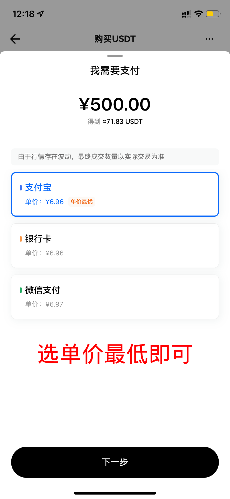
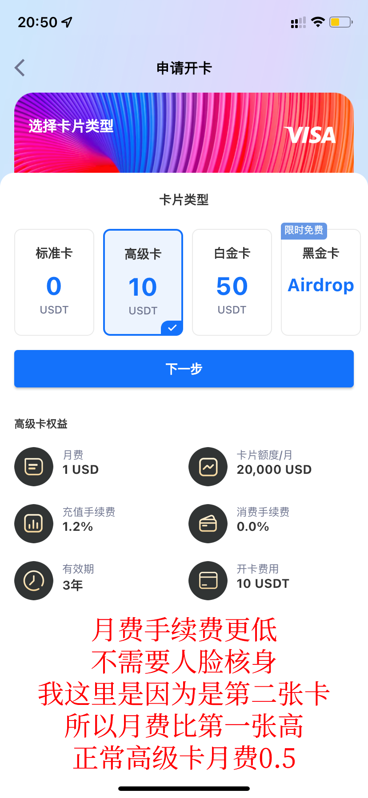

## 什么是 ChatGPT

`ChatGPT` 是一个基于自然语言处理技术的对话引擎，由OpenAI公司开发。它可以生成符合语法和逻辑的文本，与用户进行对话，并提供各种任务的解决方案，包括答疑、文本生成、语言翻译、自动摘要、推荐等。

## Plus 服务与普通服务的区别

`ChatGPT Plus` 相对于普通服务，提供更快的响应速度、更高的可靠性、更好的自适应性和更丰富的功能。

## 价格

`ChatGPT Plus` 服务的价格 20美刀一个月。

## 开通流程

### 流程简介

`ChatGPT Plus` 可以通过信用卡、借记卡的形式开通。

这里的信用卡和借记卡都需要是国外的卡，国内的卡是无法开通的。

但国内的普通人是没法开通国外的借记卡的，所以只剩下信用卡的形式了。

信用卡有一种虚拟卡的形式，可以通过一些网站申请，但并不是所有的信用卡商都可以。

:::tip 亲测可用的虚拟卡平台
这里推荐 `Depay`，亲测可用：[Depay 官网](https://depay.depay.one/web-app/register-h5?invitCode=970508&lang=zh-cn)。
:::

但是 `Depay` 的开通与支付均需要虚拟币的方式来进行。

所以又要先购买虚拟币往 `Depay` 账户里充值，然后再开通 `Depay` 的虚拟卡。

:::tip 号称最易用的虚拟币平台
这里推荐 `欧易`，亲测好用： [欧易 官网](https://okx.com/join/73954880)
:::

需要注意的是，不管是哪个平台，均需要科（翻）学（墙）上网软件才能访问。

所以整个流程梳理下来是：

科学上网软件 -> `欧易` 虚拟币平台 -> `Depay` 虚拟卡平台 -> `ChatGPT Plus`

1. 下载科学上网软件并连接，以便访问虚拟币交易平台和虚拟卡平台；
2. 注册并购买欧易虚拟币平台的虚拟币；
3. 在 `Depay` 虚拟卡平台上使用虚拟币购买虚拟信用卡；
4. 使用国外地址和IP地址，在 `ChatGPT` 官网上开通 `ChatGPT Plus`服务。

下面是文字教程，如果想直接看图片教程，请[点击这里](#图文教程)。

### 科学上网软件

这里不推荐，自行解决。

### 欧易虚拟币平台

[欧易](https://okx.com/join/73954880) 是一个虚拟币交易平台，可以通过微信、支付宝的形式购买虚拟币。

注册并购买虚拟币的过程比较简单，您只需要提供相应的信息和完成一些简单的验证就可以购买虚拟币。

不要被这东西吓到，我自己第一次试了之后发现不复杂，搞完还可以弄懂怎么做数字货币交易了。

:::danger 注意
* 苹果需要外区账号才能下载；
* 安卓可以直接下载安装；
* 交易是 `C2C` 的（即个人对个人，但有平台负责）；
* 注册后不要在网页端购买，网页端购买会被风控，资金需要一周才能转出来用，而 APP 端只需要 24 小时。
:::

#### 先注册个账号

这里推荐手机号直接注册，我一开始用邮箱，想着不暴露手机号，但后来发现还是要手机号，还不如直接一开始就用手机号注册。

#### 购买虚拟币

点击 `即刻买币`，然后选择 `USDT`，然后选择 `支付宝`、`微信`或`银行卡`中费率最低的，然后点击 `下一步`。

* 接下来选择 USDT。

* 然后输入金额，推荐充 25 个币。

* 之后选择支付方式，选择单价最低的即可。

* 之后进入到 `C2C` 交易页面，按步骤进行转账即可。这里给出 `WX交易` 演示的截图。

* 接下来，由于账号注册的限制，会被风控 24 小时，限制转出，这里需要等待后再进行下一步操作。

:::info 等待吧
24 小时后。。。
:::

* 点下面蓝色按钮，然后点提现。

* 选数字货币提现

* 选 USDT

* 选提币，23/24 个

* 随后被要求输入地址

:::tip 提示
这里的地址对应的是 `Depay` 上的钱包地址。下面我们讲解下 `Depay` 相关内容。
:::

### Depay 虚拟卡平台

[Depay](https://depay.depay.one/web-app/register-h5?invitCode=970508&lang=zh-cn) 是一个虚拟卡平台，可以通过虚拟币的形式购买虚拟卡。

您可以使用欧易虚拟币平台购买虚拟币，然后在Depay上使用虚拟币购买虚拟信用卡。

:::danger 注意
最好直接买高级卡！除非不介意个人信息泄露，因为普通卡需要人脸核身，如果打算使用时间长的，所有费用算下来还跟高级卡差不多。
根本没必要开普通卡。
:::

* 先注册个账号

* 接着点击『钱包』tab，选择 `USDT`。

* 点击『充币』

* 选择主网『TRC20』，注意一定不要选错，选错会导致无法到账。

* 然后复制『充值地址』，然后去欧易平台提现。

:::tip 提示
接下来切换到欧易平台
:::

* 还记得欧易上一步的操作吗？选提币后要求输入地址。

* 粘贴之前的复制好的充值地址，点击预览订单

* 点击确认

* 被要求输入两个验证码

:::info 等待 15 - 20 分钟
耐心等待转账结果完成即可。
:::

* 转账成功后，返回到 Depay 平台，点击『钱包』tab，点击上面的实时兑换。

这里选择 `USDT` 到 `USD`，因为实际开卡用的是 `USD`，手续费这里还要收。

兑换 22 个，扣除手续费后剩 21.x 个，然后开发还要收 1 个，到时候就剩刚好 20 个多一点。

* 兑换完成后，返回 tab 『卡』，点击申请卡。

* 这里有多种卡片类型，一般在『标准卡』和『高级卡』之间选择，这里选择『高级卡』。

* 然后进行邮箱/手机验证码验证

:::tip 恭喜！
申请卡成功！
:::

* 接下来查看卡片信息，点击『卡』tab，点击卡片下面的『CVV安全码』。

* 这些信息保存好，等下开卡要用到，注意切勿泄露！！！。

:::tip 提示
接下来我们去申请 `ChatGPT Plus` 咯！
:::

### ChatGPT Plus

开通 `ChatGPT Plus` 服务需要在 `ChatGPT` 官网上进行。

需要注意两个问题：

1. `IP` 需要用国外的，开全局模式，如果提示卡片被拒绝，就换 `IP + 浏览器无痕模式`，地区换日本、巴西、德国、美国，不行就多切换；
2. 地址，需要填写国外的地址，并且大部分地区是收税的，可以使用 `OR 州` 的地址，不收税，这里有[地址生成器](https://www.meiguodizhi.com/usa-address/oregon)。

## 流程

* 在 `ChatGPT` 页面点击 `Upgrade to Plus`，选择 20 美刀。

* 最重要的流程来了。

* 从地址生成器中复制一个地址，然后粘贴到支付信息的地址栏中。

* 然后把之前的卡片信息也贴过来，注意『月/年』和『CVV』。

* 点击确认后，等待即可，若失败，换 `IP` + 无痕模式 后重试。

* 恭喜你，成功开启 `ChatGPT Plus` 服务。

## 开通成功后

### GPT4 频率限制及使用体验

`ChatGPT Plus` 服务使用 `GPT-4`，相对于 `GPT-3.5` 来说具有更强的能力。

但是最底下一行字：

> GPT-4 currently has a cap of 25 messages every 3 hours. Expect significantly lower caps, as we adjust for demand.

3 小时才 25 条，实在是太少了。

### GPT 3.5 使用体验

`GPT 3.5` 对比免费版稳定、响应速度快，使用体验非常好。

## 总结

总体而言，`ChatGPT Plus` 服务的开通流程相对繁琐，需要使用虚拟币和科学上网软件，同时也需要注意税费和使用限制等问题。

但是，`ChatGPT Plus` 服务的性能和功能也更加出色，对于有高要求的用户来说是一种不错的选择。

当然，也可以使用 `API` 的方式来使用，相对来说会更划算。